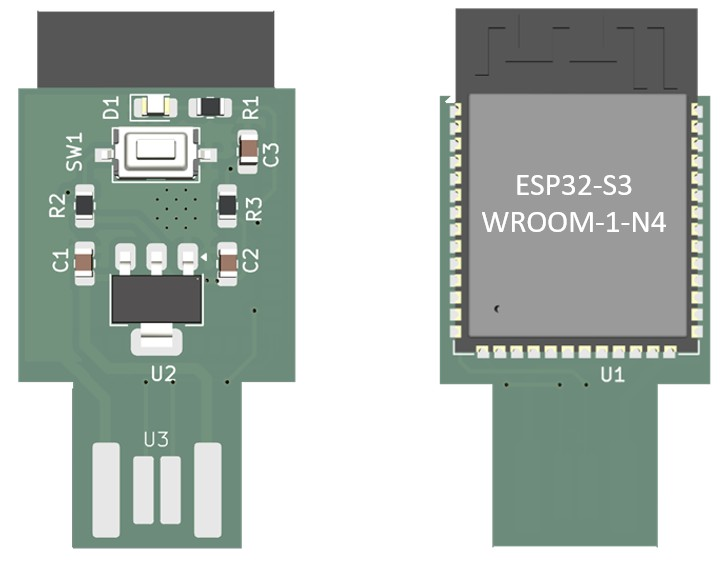

# Description

ESP32’s are nice microcontrollers, but not this one! This project describes how to build a WiFi rubber ducky or “bad USB”. No programming skills are required, just buy a standard ESP32 S2 board or build the custom ESP32 S3 board and flash it with the online tool.  

Watch the YouTube video, it will guide you through the process step by step:

The precompiled bin files include some fun examples to get you started.  
Original code is from SpaceHuhn, buy SpaceHuhn a coffee or give a donation on PayPal here: [SpaceHuhn](https://github.com/SpacehuhnTech/WiFiDuck)  
The code was adaptemd for the ESP32 S2/S3 by Waswasd0105  [SpaceHuhn](https://github.com/wasdwasd0105/SuperWiFiDuck)
All credits go to Spacehuhn and Wasdas105!  

## Two build options included:  
The function of both is identical. They run the same legendary 'SpaceHuhn' firmware, with the same Ducky scripts.  
  
1: Quick: Use a standard ESP32 S2 board and flash the 4 bin files:  
(ESP32_S2_bin_files.zip)  
  
2: PRO: If you like soldering, use the custom ESP32 S3 PCB:  PCB gerber files, 4 bin files, assembly drawing included:  
(ESP32_S3_BIN_PCB_gerber.zip)  
The board can be assembled with a solder iron, however hot air reflow is more convenient for the ESP32 S3 module.  
Check the video and assembly instruction for more details.  

  

If you are interested in the KiCAD10 PCB design please watch the video on my Youtube Channel: 

## Flashing the bin files:  
To flash the bin files use the ESP JS flashtool: https://espressif.github.io/esptool-js/  
Use the flash adresses as indicated in the bin filenames.  

**All files for ESP32 S2:** ESP32_S2_bin_files.zip  
  
  0x1000 bootloader_S2.bin  
  0x8000 partitions_S2.bin  
  0x10000 firmware_S2.bin  
  0x3d0000 spiffs_S2.bin  

**All files for ESP32 S3 custom PCB:** ESP32_S3_bin_PCB_gerber.zip  
  
0x0000_Bootloader_S3.bin  
0x8000_Partition_Table_S3.bin  
0x10000_app_S3.bin  
0x290000_spiffs_S3.bin  

ESP32_S3_assembly_drawing.pdf - assembly instruction  
ESP32_S3_USB_schematic.pdf - schematic only  
ESP32-S3-USB-PCB_GERBER.zip - Gerber zip to order PCB (upload as zip to vendor)  
  
You can check the gerber zip file at: https://www.gerblook.org/  
(upload ESP32-S3-USB-PCB_GERBER.zip, do not unzip)  
